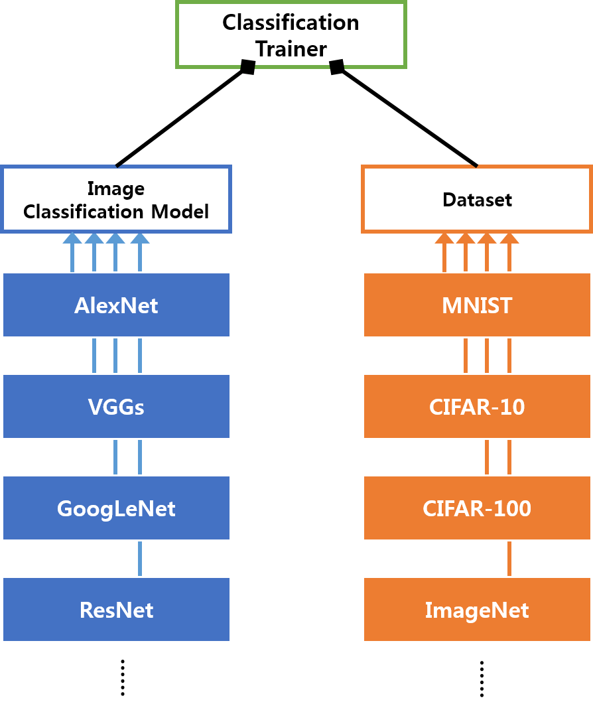

# DeepModels



This repository is mainly for implementing and testing state-of-the-art deep learning models since 2012 when AlexNet has emerged. It will provide pre-trained models on each dataset later.

In order to try with state-of-the-art deep learning models, datasets to be fed into and training methods should be also come along. This repository comes with three main parts, **Dataset**, **Model**, and **Trainer** to ease this process.

Dataset and model should be provided to a trainer, and then the trainer knows how to run training, resuming where the last training is left off, and transfer learning.

## Dependencies
- numpy >= 1.14.5
- scikit-image >= 0.12.3
- tensorflow >= 1.6
- tqdm >= 4.11.2
- urllib3 >= 1.23

```sh
# install all the requirements.

pip install -r requirements.txt
```

## Testing Environment
- macOS High Sierra (10.13.6) + eGPU encloosure (Akitio Node) + NVIDIA GTX 1080Ti
- [floydhub](https://www.floydhub.com/) + NVIDIA TESLA K80, + NVIDIA TESLA V100
- [GCP cloud ML engine](https://cloud.google.com/ml-engine/) + NVIDIA TESLA K80, + NVIDIA TESLA P100, + NVIDIA TESLA V100

## Pre-defined Classes
#### Datasets
- **[MNIST](http://yann.lecun.com/exdb/mnist)**
  - 10 classes of handwritten digits images in size of 28x28
  - 60,000 training images, 10,000 testing images
- **[CIFAR-10](https://www.cs.toronto.edu/~kriz/cifar.html)**
  - 10 classes of colored images in size of 32x32
  - 50,000 training images, 10,000 testing images
  - 6,000 images per class
- **[CIFAR-100](https://www.cs.toronto.edu/~kriz/cifar.html)**
  - 100 classes of colored images in size of 32x32
  - 600 images per class
  - 500 training images, 100 testing images per class
- **Things to be added**
  - **[STL-10](https://cs.stanford.edu/~acoates/stl10/)**
  - **[ImageNet](http://www.image-net.org/)**

#### Models
- **[AlexNet](https://papers.nips.cc/paper/4824-imagenet-classification-with-deep-convolutional-neural-networks.pdf)** | 2012 | [[CODE]](./models/alexnet.py)
- **[VGG](https://arxiv.org/pdf/1409.1556.pdf)** (model type = [A | A-LRN | B | C | D | E]) | 2014 | [[CODE]](./models/vgg.py)
  - **A:** 11 layers, **A-LRN:** 11 layers with LRN (Local Response Normalization)
  - **B:** 13 layers, **C:** 13 layers with additional convolutional layer whose kernel size is 1x1
  - **D:** 16 layers (known as **VGG16**)
  - **E:** 19 layers (known as **VGG19**)
- **[Inception V1 (GoogLeNet)](https://arxiv.org/pdf/1409.4842.pdf)** | 2014 | [[CODE]](./models/googlenet.py)
- **[Residual Network](https://arxiv.org/pdf/1512.03385.pdf)** (model type = [18 | 34 | 50 | 101 | 152]) | 2015 | [[CODE]](./models/resnet.py)
- **[Inception V2](https://arxiv.org/pdf/1512.00567v3.pdf)** | 2015 | [[CODE]](./models/inception_v2.py)
- **[Inception V3](https://arxiv.org/pdf/1512.00567v3.pdf)** | 2015 | [[CODE]](./models/inception_v3.py)
- **[Residual Network V2](https://arxiv.org/pdf/1603.05027.pdf)** | 2016 | [[CODE]](./models/resnet_v2.py)
- **[Inception V4](https://arxiv.org/pdf/1602.07261.pdf)** | 2016 | [[CODE]](./models/inception_v4.py)
- **[Inception+Resnet V1](https://arxiv.org/pdf/1602.07261.pdf)** | 2016 | [[CODE]](./models/inception_resnet_v1.py)
- **[Inception+Resnet V2](https://arxiv.org/pdf/1602.07261.pdf)** | 2016 | [[CODE]](./models/inception_resnet_v2.py)
- **Things to be added**
  - **[DenseNet](https://arxiv.org/pdf/1608.06993.pdf)** | 2016
  - **[SqueezeNet](https://arxiv.org/abs/1602.07360)** | 2016
  - **[MobileNet](https://arxiv.org/pdf/1704.04861.pdf)** | 2017
  - **[NASNet](https://arxiv.org/pdf/1707.07012.pdf)** | 2017

#### Trainers
- ClfTrainer: Trainer for image classification like ILSVRC

## Pre-trained accuracy (coming soon)
- AlexNet
- VGG
- Inception V1 (GoogLeNet)

## Example Usage Code Blocks
#### Define hyper-parameters
```python
learning_rate = 0.0001
epochs = 1
batch_size = 64
```

#### Train from nothing
```python
from dataset.cifar10_dataset import Cifar10

from models.googlenet import GoogLeNet
from trainers.clftrainer import ClfTrainer

inceptionv1 = GoogLeNet()
cifar10_dataset = Cifar10()
trainer = ClfTrainer(inceptionv1, cifar10_dataset)
trainer.run_training(epochs, batch_size, learning_rate,
                     './inceptionv1-cifar10.ckpt')
```

#### Train from where left off
```python
from dataset.cifar10_dataset import Cifar10

from models.googlenet import GoogLeNet
from trainers.clftrainer import ClfTrainer

inceptionv1 = GoogLeNet()
cifar10_dataset = Cifar10()
trainer = ClfTrainer(inceptionv1, cifar10_dataset)
trainer.resume_training_from_ckpt(epochs, batch_size, learning_rate,
                                  './inceptionv1-cifar10.ckpt-1', './new-inceptionv1-cifar10.ckpt')
```

#### Transfer Learning
```python
from dataset.cifar100_dataset import Cifar100

from models.googlenet import GoogLeNet
from trainers.clftrainer import ClfTrainer

inceptionv1 = GoogLeNet()
cifar10_dataset = Cifar100()
trainer = ClfTrainer(inceptionv1, cifar10_dataset)
trainer.run_transfer_learning(epochs, batch_size, learning_rate,
                              './new-inceptionv1-cifar10.ckpt-1', './inceptionv1-ciafar100.ckpt')
```

#### Testing
```python
from dataset.cifar100_dataset import Cifar100

from models.googlenet import GoogLeNet
from trainers.clftrainer import ClfTrainer

# prepare images to test
images = ...

inceptionv1 = GoogLeNet()
cifar10_dataset = Cifar100()
trainer = ClfTrainer(inceptionv1, cifar10_dataset)
results = trainer.run_testing(images, './inceptionv1-ciafar100.ckpt-1')
```

## Basic Workflow
1. Define/Instantiate a dataset
2. Define/Instantiate a model
3. Define/Instantiate a trainer with the dataset and the model
4. Begin training/resuming/transfer learning

## References
- [TensorFlow official website](https://www.tensorflow.org/)
- [CNN Receptive Field Calculator](http://fomoro.com/tools/receptive-fields/index.html)
- [A Simple Guide to the Versions of the Inception Network](https://towardsdatascience.com/a-simple-guide-to-the-versions-of-the-inception-network-7fc52b863202)
- [UNDERSTANDING RESIDUAL NETWORKS](https://towardsdatascience.com/understanding-residual-networks-9add4b664b03)
- [Improving Inception and Image Classification in TensorFlow](https://ai.googleblog.com/2016/08/improving-inception-and-image.html)
